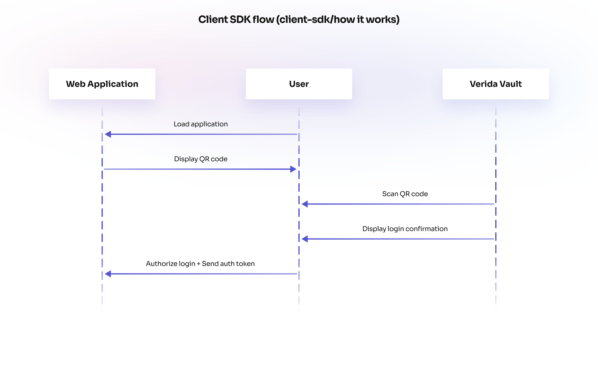

# How it Works

The Verida Client SDK provides a toolkit of self-sovereign capabilities to your decentralized application.

Here’s is the basic flow of the Vault single sign on and what is happening behind the scenes.

# 1. Users authorize access

Users authorize access to your application by signing a consent message with their Verida account to unlock an [Application Context](../concepts/application-contexts.md).

If this is the first time the account has authorized your application, a new DID document is created (see [identity](../concepts/accounts-and-identity.md)).

This DID document includes the URI of the CouchDB database hosting the account’s encrypted data along with public keys. The DID document is public, allowing other users and applications to discover user’s database endpoints and public keys for securely sending data.

# 2. Create user databases

Application contexts store data stored in two locations:

- Locally, within the browser, using [PouchDB](https://pouchdb.com/)
- Remote, controlled by the application developer or the end user, using [CouchDB](https://couchdb.apache.org/)

When a database is created (via `context.openDatabase(...)`) a local unencrypted database is created in the browser and remote encrypted database is created on the remote CouchDB server.

Remote user databases are created by sending an API request to the [Storage Node](../storage-node.md) API server. This server manages the underlying database permissions of the CouchDB database server.

All requests to the Storage Node API must include a signed consent message by the user. This ensures only the user holding the private key of the public blockchain account can set their database permissions.

<aside>
💡 The Verida architecture is designed to be expandable to support alternative decentralized storage engines in the future

</aside>

# 3. Reading and writing data

When a database is opened, the Client SDK connects to the encrypted remote database and synchronizes its local copy, automatically decrypting the data into the unencrypted PouchDB database.

This allows your application to run queries within the browser on the decrypted data.

Any changes to data are syncronized in real-time between the local and cloud databases. Data is automatically decrypted / encrypted between the local database and the remote encrypted database.

# 4. Sending messages

Messages can be sent between two application contexts for a single Verida account or between different Verida accounts.

At a high level, each message uses asymmetric encryption whereby the message is encrypted with the recipients public key and the sender’s private key. This is then encapsuated in a Decentralized Identity Javascript Web Token (DID-JWT) and sent to a public database controlled by the recipient. The recipient can then decrypt and process that message as appopriate.