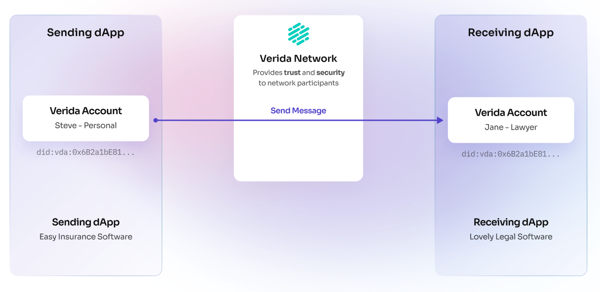

# Messaging

The Verida Protocol facilitates decentralized messaging between Verida accounts.

## Architecture

Messages on the Verida protocol operate on two dimensions; the Verida Account and the Application Context. As such, a Verida Account has an `inbox` and `outbox` for every Application Context.

In the example above we have the account `Steve - Personal` from the application context `Easy Insurance Software` sending a message to account `Jane - Laywer` in the `Lovely Legal Software` application context.

This architecture allows applications to develop their own message types for domain specific data sharing and messaging.

In this case the message is being sent to a Verida account (`did:vda:0x6B2a1bE81...). In the future will support Verida accounts being linked to onchain addresses, providing a decentralized messaging system that works across multiple addresses and multiple chains.

## How it works

### Sending a message

A message is constructed as an encrypted [DID-JWT](https://github.com/decentralized-identity/did-jwt) and wrapped in a [Verida `Inbox Item` schema](https://github.com/verida/schemas-core/blob/develop/inbox/item/v0.1.0/schema.json).

The message is encrypted using the private key of the sender and the public key of the recipient. This ensures only the recipient can decrypt the message. The recipient public key is obtained by looking up the recipient's DID Document and locating the public key registered for the recipient application context.

The encrypted message is then sent to the recipient. Every application context maintains a publicly writeable `inbox` database. The message sender opens this `inbox` database owned and controlled by the recipient, then saves the encrypted message for their retrieval. The database address is obtained by looking up the `MessagingServer` endpoint registered in the recipient's DID document for the recipient application context.

[See source code](https://github.com/verida/verida-js/blob/5b3dc59d2cabf0ee9347325c4e9f5a3ccb0155cc/packages/client-ts/src/context/engines/verida/messaging/outbox.ts#L59).

### Receiving a message

An encrypted message is received by the recipient in their public `inbox` database. The sender and application context is encoded in the message, which the recipient uses to lookup the public key of the sender. The recipient then decrypts the message, saves the decrypted message into a private inbox and deletes the original encrypted message.

[See source code](https://github.com/verida/verida-js/blob/5b3dc59d2cabf0ee9347325c4e9f5a3ccb0155cc/packages/client-ts/src/context/engines/verida/messaging/inbox.ts#L52).

The Verida SDK automatically monitors the public inbox to process any new inbox items. It also offers events that can be subscribed to, which fire when a new inbox message has been processed.

# Learn more

See [Client SDK - Messaging](../client-sdk/messaging.md) to learn more about using messaging in your application.

It is possible to define your own custom message types. There are no tutorials available yet, however you can [browse examples of current message types](https://github.com/verida/schemas-core/tree/develop/inbox/type/) as a starting point.